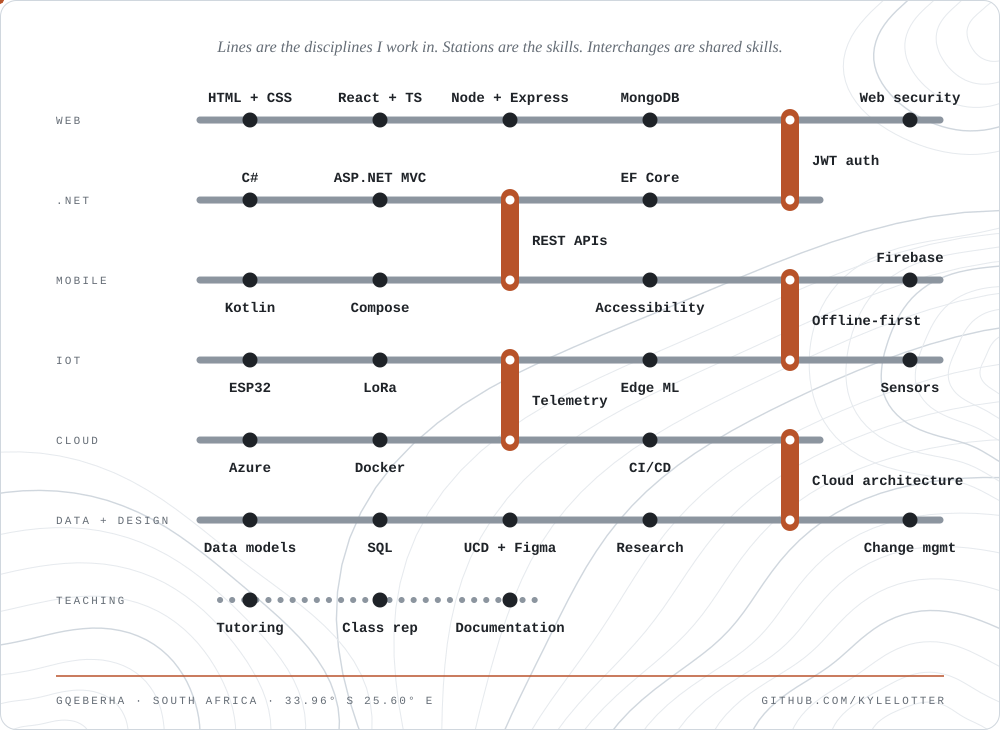
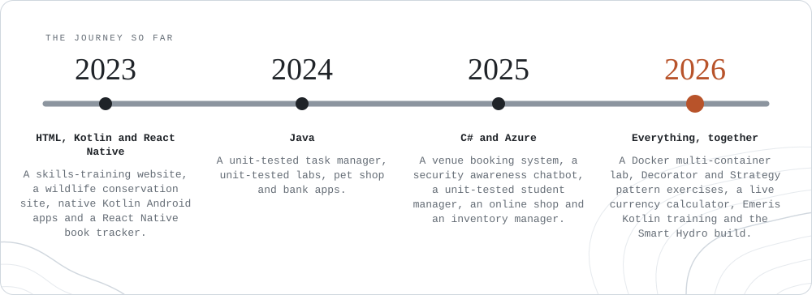
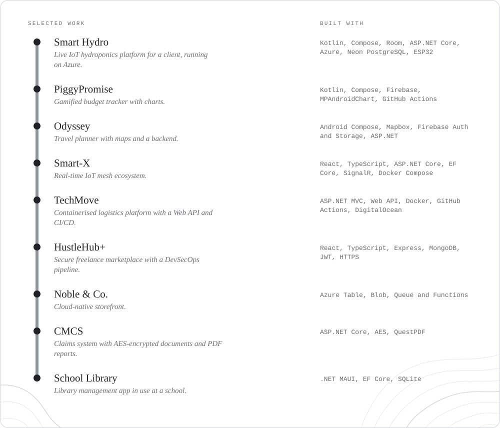
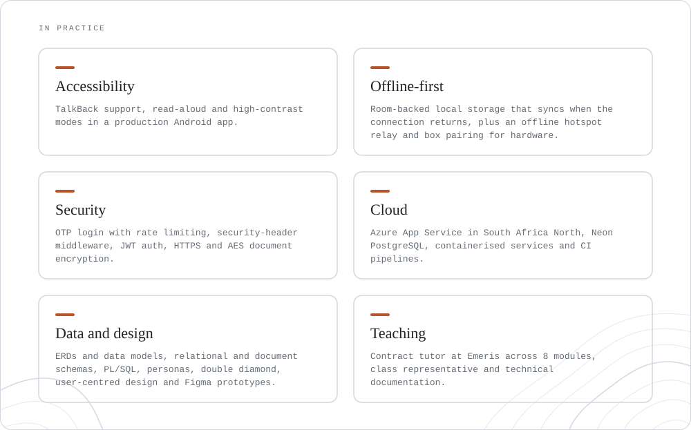
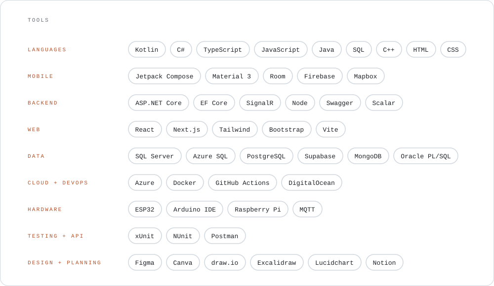

<picture>
  <source media="(prefers-color-scheme: dark)" srcset="assets/map-dark.svg">
  
</picture>

 

Gqeberha, South Africa

 

<a href="https://www.linkedin.com/in/kyle-lotter">
<picture>
  <source media="(prefers-color-scheme: dark)" srcset="assets/linkedin-dark.svg">
  
</picture>
</a>

 

<picture>
  <source media="(prefers-color-scheme: dark)" srcset="assets/journey-dark.svg">
  
</picture>

 

<picture>
  <source media="(prefers-color-scheme: dark)" srcset="assets/projects-dark.svg">
  
</picture>

 

<picture>
  <source media="(prefers-color-scheme: dark)" srcset="assets/practice-dark.svg">
  
</picture>

 

<picture>
  <source media="(prefers-color-scheme: dark)" srcset="assets/tools-dark.svg">
  
</picture>
